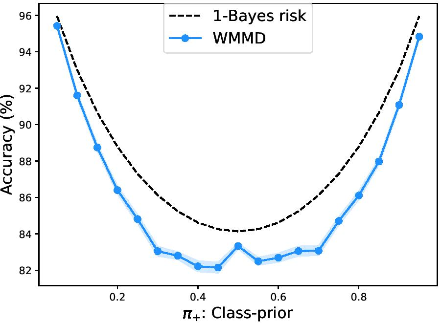

## Principled analytic classifier for positive-unlabeled learning via weighted integral probability metric

PyTorch based implementation of the paper "Principled analytic classifier for positive-unlabeled learning via weighted integral probability metric" authored by Yongchan Kwon, Wonyoung Kim, Masashi Sugiyama, and Myunghee Cho Paik. This github is created for the ACML 2019 journal review. [[ArXiv]](https://arxiv.org/abs/1901.09503)


## Directory tree

```bash
.
├── data.py
├── wmmd.py
├── comparison.py
├── illustration.py
├── main.py
└── README.md
```

- `data.py` generates datasets used for synthetic data analysis in the paper.
- `wmmd.py` contains the proposed algorithm
- `comparison.py` calculates and plots the accuracy and AUC of the proposed algorithm with the synthetic data
- `illustration.py` plots the decision boundary for the proposed classifier with the `two_moons` datasets

## Requirements
- Python 3
- Pytorch 1.0
- numpy >= 1.8.2
- scipy >= 0.13.3
- sklearn 0.0
- matplotlib 3.0.2
- tqdm 4.29.1

For GPU configuration:
- CUDA 9.0


## Quick start

To generate the upper right illustration in Figure 1, you simply run the following code.

```bash
python main.py -p 'figure1' -P 5 -U 50
```

To generate a plot from Figure 1, you should **add some options for the size of positive and unlabeled samples**. For example, the following code generates a plot of Figure1 with 10 positive samples and 400 unlabeled samples,

```bash
python main.py -p 'figure1' -P 10 -U 400
```
With the `-P` and `-U` options, you can change the positive and unlabeled sample sizes manually.

After running this code, the result figure is saved as 'figure1.pdf' in current directory. If you want to change the directory or filename, you can use `-d` and `-f` options.

```bash
python main.py -p 'figure1' -d './example_figures/' -f 'my_best_figure.pdf'
```

The available preset plots are:
- Figure1: An illustration of the WMMD decision boundary with `two_moons` dataset.
- Figure2a: A plot of accuracy on various class-prior.
- Figure2b: A plot of AUC on various class-prior.
- Figure2c: A plot of accuracy on various unlabeled sample size.
- Figure2d: A plot of AUC on various unlabeled sample size.

For the configuration of GPU, add `-g` option with zero-origin GPU ID.
```bash
python main.py -p 'figure1' -P 10 -U 50 -g 0
```

## Example results
- `figure1.jpg`: an illustration of the WMMD decision boundary with `two_moons` dataset.


- `figure2a.jpg`: a plot of accuracy on various unlabeled sample size.


- `figure2b.jpg`: a plot of AUC on various unlabeled sample size.


- `figure2c.jpg`: a plot of accuracy on various class-prior.


- `figure2d.jpg`: a plot of AUC on various class-prior.


<!---

## Detailed usage

You can use `-m` options to generate one of the below plots:
- `accuracy_n_u`: A plot of accuracy on manually selected unlabeled sample size.
- `accuracy_pi_plus`: A plot of accuracy on manually selected class-prior.
- `AUC_n_u`: A plot of AUC on manually selected unlabeled sample size.
- `AUC_pi_plus`: A plot of accuracy on manually selected class-prior.
- `illustration_normal`: An illustration of the WMMD decision boundary with `two_normal` dataset.
- `illustraion_circles`: An illustration of the WMMD decision boundary with `two_circles` dataset.
- `illustraion_moons`: An illustration of the WMMD decision boundary with `two_moons` dataset.

--->

